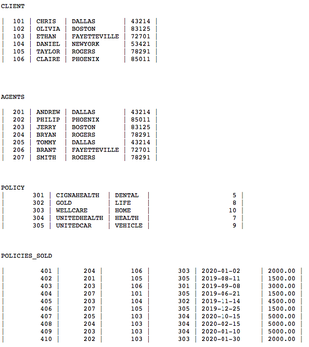

# A simple database interface in Java (JDBC, MySQL).

A database that emulates the operations of an insurance company. The DB's schema contains tables for Clients, Agents, Policies, and Policies Sold. Agents have several corresponding Clients, Clients have corresponding Policies.

Data for populating the DB is from `policy_data.txt`, and the SQL schema for implementing these tables is in `schema.txt`.

Menu operations:
1. Find and display all agents and clients in a given city.
2. Add a new client, then purchase an available policy from a local agent.
3. List all policies sold by a particular agent.
4. Cancel a policy.
5. Add a new agent to a city
